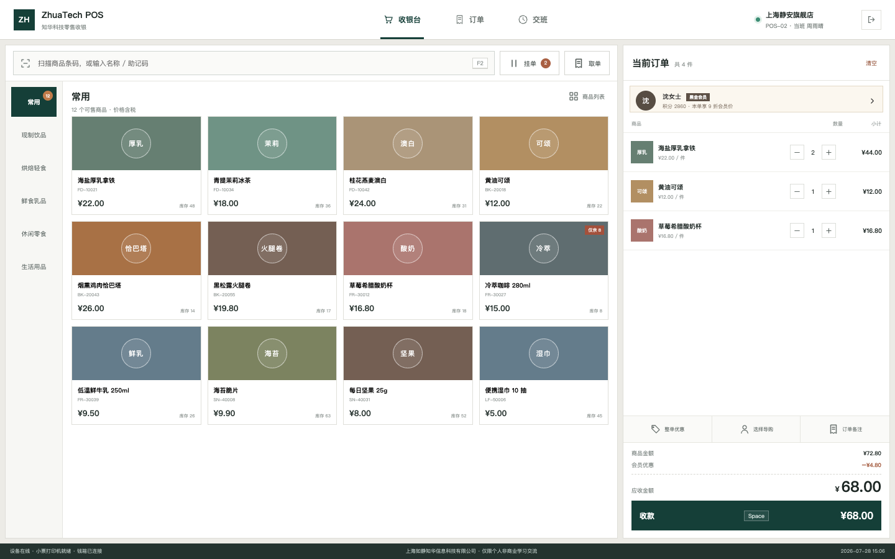
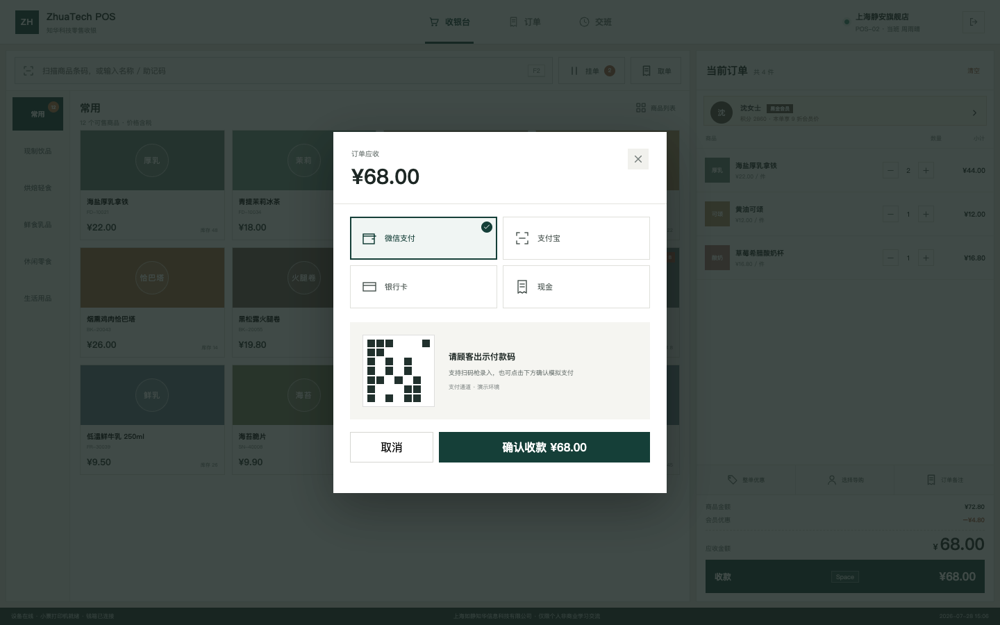
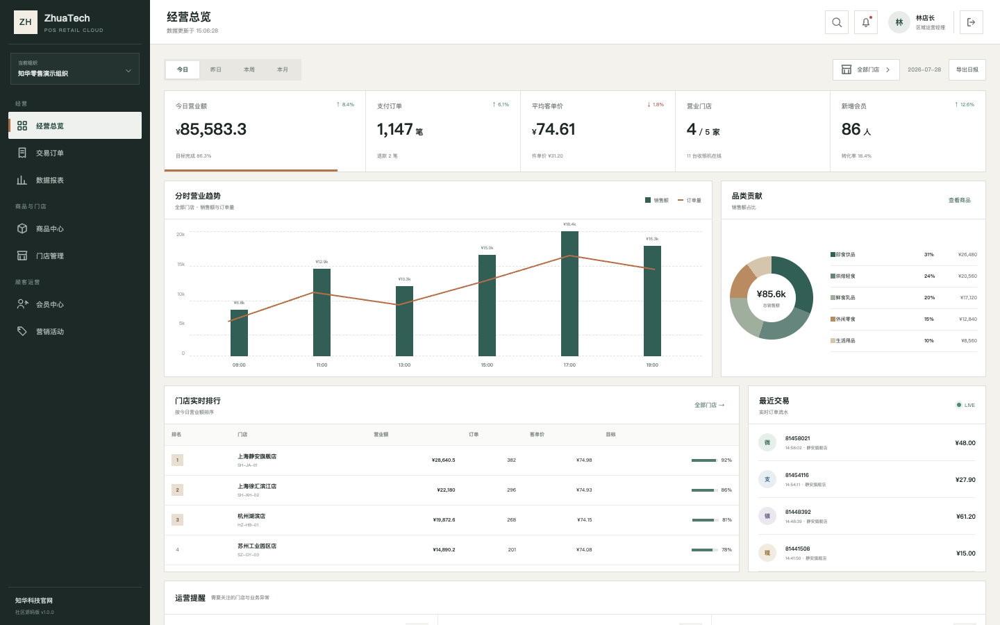
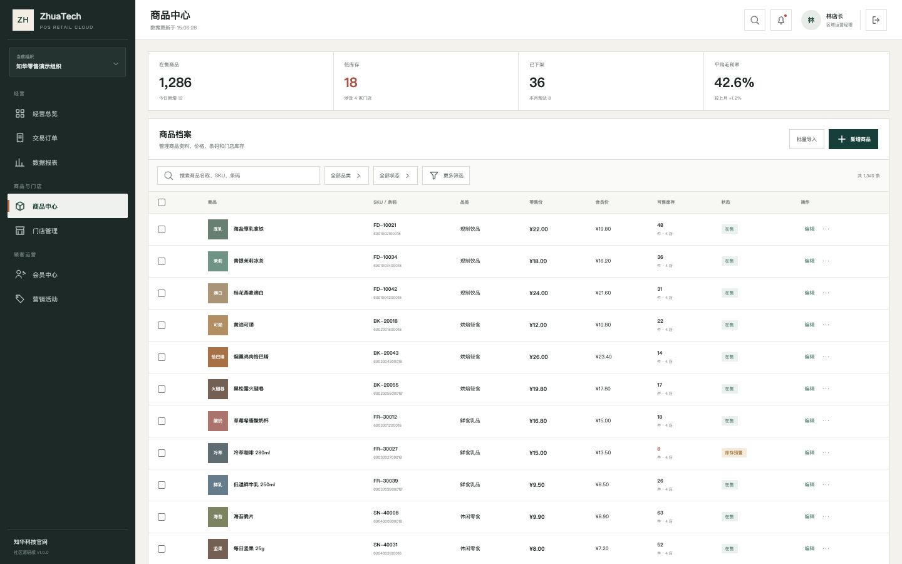

# ZhuaTech POS｜知华科技零售收银系统社区源码版

## 企业级增强：退款与作废治理

新增原交易与金额核验、原路退款、职责分离、库存/权益/税务冲销、幂等、离线对账和欺诈审查，详见[退款与作废治理](docs/ENTERPRISE_REFUND_VOID_GOVERNANCE.md)。

## 企业级增强：支付结算与关班治理

新增支付渠道、现金钱箱、退款、拒付和负责人签署联合核对，差异超容差自动阻断关班，详见 [结算关班治理](docs/ENTERPRISE_SETTLEMENT_CLOSE.md)。

**门店负责把交易做对，总部负责把生意看清。** ZhuaTech POS 是一套前后端分离的零售收银系统样板，包含面向店员的触屏收银端、面向店长和总部的 PC 管理端，以及 Java 21、Spring Boot、MySQL 构建的业务 API。

[知华科技](https://www.zhuatech.cn/)（上海如静知华信息科技有限公司）提供 POS、ERP、OMS、WMS 等企业信息化系统的规划、私有化部署、设备集成和深度定制开发服务。

    

> [!IMPORTANT]
> 本工程仅允许自然人用于个人、非商业性的学习、研究和技术交流。企业内部使用、实际门店收银、生产部署、SaaS、实施交付、咨询、外包、集成、销售以及任何直接或间接商业使用，均须事先取得上海如静知华信息科技有限公司的书面授权。本项目属于 source-available 社区源码项目，并非 OSI 认可的开源软件。完整条款请阅读 [LICENSE](LICENSE)。

## 从顾客到总部，一笔订单走过两个工作台

```text
顾客选购 → 扫码/点选商品 → 识别会员 → 促销试算 → 聚合支付 → 小票/钱箱
                                      │
                                      ▼
             交易流水 → 门店对账 → 商品分析 → 会员运营 → 总部经营决策
```

系统没有把“用户端”简单处理成缩小版后台。收银端围绕扫码、购物车、会员、优惠、收款和交班设计；管理端围绕跨门店经营、商品、订单、会员、营销和报表设计。二者共享统一的商品、会员、订单和权限模型。

## 门店用户端：为高频操作留出明确路径



收银工作台针对 1366/1440 桌面触屏和传统键鼠环境设计。商品分类、商品宫格、当前订单和应收金额保持在同一屏，关键动作保留键盘提示，减少结账过程中的页面跳转。

| 操作区域 | 已实现能力 |
| --- | --- |
| 商品录入 | 条码/名称搜索、分类筛选、常用商品、点击加购、低库存提示 |
| 购物车 | 数量增减、删除、清空、挂单入口、商品金额与优惠试算 |
| 顾客识别 | 会员信息、等级、积分、会员价提示、导购与备注入口 |
| 收款 | 微信、支付宝、银行卡、现金四种演示通道与付款码交互 |
| 售后 | 当班订单查询、小票预览、补打小票、退款申请入口 |
| 班次 | 支付方式汇总、现金面额清点、长短款提示、接班人和交班备注 |

### 收款不是一个孤立按钮



收款弹窗保留订单应收、支付方式、付款码状态和确认动作。当前为可交互演示实现；商业版本应在服务端完成支付签名验证、幂等控制、超时撤销、退款原路退回、支付通知验签和财务对账。

## 后台管理端：用经营口径组织数据



管理端采用适合企业软件的固定导航、实体边界和高密度数据表。经营总览将营业额、订单、客单价、会员、分时趋势、品类贡献、门店排行、实时交易和运营提醒放在一个稳定的阅读层级中。



商品中心体现后台管理端的基础操作方式：检索与筛选位于表格上方，SKU、条码、价格、会员价、跨店库存和状态使用固定列呈现，低库存以克制的状态色提示。

后台模块覆盖：

- 经营总览：核心指标、分时销售、品类贡献、门店排行、实时订单和运营告警。
- 商品中心：商品档案、SKU/条码、分类、零售价、会员价、库存和上下架状态。
- 交易订单：门店订单、支付方式、优惠、退款、收银机与操作人追踪。
- 门店管理：门店档案、营业状态、设备在线率、营业额、订单和目标达成。
- 会员中心：等级、积分、储值、消费、到店次数和最近访问。
- 营销活动：组合价、第 N 件折扣、优惠券、会员活动和活动投入产出。
- 数据报表：销售、商品、会员、门店、资金对账、营销分析与定时报表入口。

## 工程实现

```text
Vue 3 + Vite + Pinia
  ├─ /cashier/*  门店用户端：收银、订单、交班
  └─ /admin/*    后台管理端：经营、商品、门店、会员、营销、报表
                  │ REST / JSON + JWT
                  ▼
Spring Boot 4 + Spring Security + JPA + Flyway
                  │
                  ▼
MySQL 8.4（pos_ 表前缀）
```

- Java 根包：`cn.zhuatech.pos`
- 核心实体：`Product`、`Store`、`Member`、`CashierShift`、`PosOrder`、`PosOrderItem`、`UserAccount`
- 结账事务：商品校验 → 库存扣减 → 优惠校验 → 订单落库 → 明细落库
- 权限角色：系统管理员、门店经理、收银员、审计人员
- 数据迁移：Flyway 管理 `pos_` 前缀表结构

详细设计见 [架构说明](docs/ARCHITECTURE.md)，接口清单见 [API 文档](docs/API.md)。

## 运行演示

### 只运行前端演示

前端内置与接口字段一致的零售演示数据，不需要数据库：

```bash
cd frontend
npm install
npm run dev:demo
```

打开 `http://localhost:5173`，登录页可以选择“收银工作台”或“运营管理端”。

| 入口 | 用户名 | 密码 | 默认页面 |
| --- | --- | --- | --- |
| 收银工作台 | `cashier` | `Demo@2026` | `/cashier/terminal` |
| 运营管理端 | `manager` | `Demo@2026` | `/admin/dashboard` |

### Docker Compose

要求 Docker 与 Docker Compose 可用：

```bash
cp .env.example .env
docker compose up --build -d
```

浏览器打开 `http://localhost:8090`。结束演示使用 `docker compose down`。

### 本地全栈开发

```bash
# 后端：JDK 21、Maven 3.9、MySQL 8
cd backend
mvn spring-boot:run

# 前端：另开终端
cd frontend
npm install
npm run dev
```

后端演示账号还包括 `admin / ZhuaTech@2026` 和 `auditor / Demo@2026`。任何经授权的联网部署都必须更换所有默认密码、数据库凭据和 `JWT_SECRET`。

## 目录导航

```text
zhuatech-pos/
├── backend/              Java 21 / Spring Boot REST API
│   └── src/main/java/cn/zhuatech/pos
├── frontend/             Vue 3 双工作台前端
│   └── src/views/
│       ├── cashier/      门店收银用户端
│       └── admin/        PC 后台管理端
├── docs/
│   ├── images/           Playwright 实际运行截图
│   ├── API.md
│   └── ARCHITECTURE.md
├── deploy/               生产化部署注意事项
├── compose.yaml          MySQL + API + Nginx 编排
└── LICENSE               个人非商业社区源码许可
```

## 第一版的边界

当前版本提供能够运行和演示的业务骨架，不应在未获商业授权、未完成安全评审的情况下处理真实支付或会员数据。以下内容留作商业版和深度定制范围：

- 微信/支付宝/银联真实支付、原路退款、支付路由、对账与清分；
- 小票打印机、钱箱、客显、电子秤、扫码枪、标签机和自助收银设备协议；
- 离线收银、断网续传、边缘节点、订单幂等、消息队列与高可用；
- 多业态商品、复杂促销引擎、电子券、储值、积分账本与会员隐私治理；
- 进销存、ERP/OMS/WMS、电子发票、财务系统和第三方配送平台集成；
- 多组织权限、操作审计、数据权限、等保、安全加固、监控与灾备。

个人学习者可以通过 Issue 提交可复现的问题。参与前请阅读 [CONTRIBUTING.md](CONTRIBUTING.md)、[CODE_OF_CONDUCT.md](CODE_OF_CONDUCT.md) 和 [SECURITY.md](SECURITY.md)。

## 商业授权与深度定制

上海如静知华信息科技有限公司可提供零售业务梳理、POS/ERP/OMS/WMS 集成、支付与硬件设备对接、会员营销、数据迁移、私有化部署、性能优化和长期技术支持。

- 知华科技官网：[https://www.zhuatech.cn/](https://www.zhuatech.cn/)
- 公司：上海如静知华信息科技有限公司
- 咨询方式：访问官网，或扫描以下任一微信二维码

<table>
  <tr>
    <td align="center"><br/>微信咨询一</td>
    <td align="center"><br/>微信咨询二</td>
  </tr>
</table>

---

Copyright © 2026 上海如静知华信息科技有限公司（Shanghai Rujing Zhihua Information Technology Co., Ltd.）

**搜索关键词：** 知华科技 POS、ZhuaTech POS、Java POS 系统、Spring Boot 收银系统、Vue POS、零售收银源码、门店收银系统、会员管理系统、零售管理后台、聚合支付、POS 私有化部署、POS 二次开发、多门店管理、商品管理、交班对账、上海 POS 定制开发、零售数字化。

## 交班对账：把差异留在当班解决

新接口 `POST /api/pos/shift-reconciliation` 会根据系统现金、备用金、退款与实点现金计算钱箱应有额和差异，并分为 `BALANCED / REVIEW / BLOCK`。超过阈值时返回复核收款、退款和备用金记录的动作，重大差异会直接建议暂停交班并通知门店经理。

电子支付金额会随对账结果一并归档；管理端集成测试覆盖现金短款复核场景。

## 促销毛利门禁

新增 `POST /api/pos/promotion-margin-guard`，在活动下发前计算折后收入、商品成本、积分成本、单件毛利和整场活动毛利，并输出 `APPROVE / REVIEW / BLOCK`。门店可以在收银优惠生效前识别负毛利和低毛利方案，降低价格配置错误带来的经营损失。

## 班次退款风险复核

`POST /api/pos/insights/refund-risk` 从退款笔数、退款金额、交易作废和人工折扣四类信号识别异常班次，返回 `PASS / VERIFY_SAMPLE / REVIEW_SHIFT` 决策与解释原因，便于店长进行抽样核验和交班复盘。
